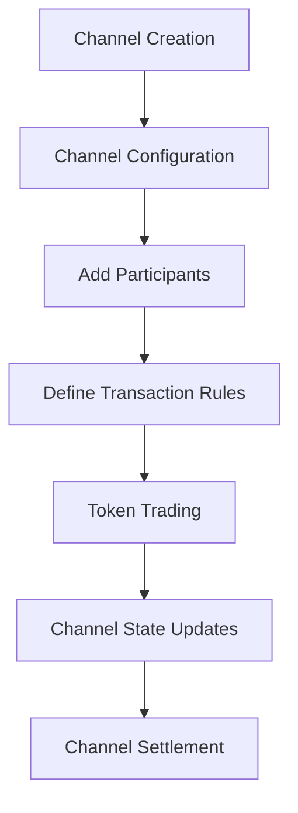

# SFT Channel: Secure Token Trading Framework

A blockchain-based channel management platform built on Stacks that enables secure, configurable token trading and interaction channels.

## Overview

SFT Channel provides a robust, decentralized framework for creating and managing token-based interaction channels with advanced access control and transaction rules. The platform offers:

- Secure, programmable token trading channels
- Flexible access control mechanisms
- Customizable transaction rules
- Transparent channel state tracking
- Decentralized participant management

## Architecture

The SFT Channel platform is built around a core smart contract that manages channel creation, participant interactions, and token transactions.



### Core Components

1. **Channel Management**: Creates and configures interaction channels
2. **Participant Control**: Manages channel membership and permissions
3. **Transaction Rules**: Defines and enforces trading guidelines
4. **State Tracking**: Maintains transparent channel state and history

## Contract Documentation

### sft-channel-core.clar

The main contract handling core functionality of the SFT Channel platform.

#### Key Features

- Channel creation and configuration
- Participant management
- Custom transaction rule enforcement
- Secure token trading mechanisms
- Transparent channel state tracking

#### Access Control

- General users can register, log workouts, and join challenges
- Challenge creators can end their own challenges
- Contract owner can add new workout types

## Getting Started

### Prerequisites

- Clarinet
- Stacks wallet for interaction

### Installation

1. Clone the repository
2. Install dependencies with Clarinet
3. Deploy contracts to the Stacks network

### Basic Usage

```clarity
;; Create a trading channel
(contract-call? .sft-channel-core create-channel 
    "High-Frequency Trading Group" 
    "Automated token trading with strict rules" 
    u10000 u1000 true)

;; Add participant to channel
(contract-call? .sft-channel-core add-participant u1 'STX123...)

;; Execute token trade
(contract-call? .sft-channel-core execute-trade 
    u1 
    'STX123... 
    'STX456... 
    u500 
    (some "Limit order: max price"))
```

## Function Reference

### Public Functions

#### `create-channel`
```clarity
(define-public (create-channel 
    (name (string-utf8 100)) 
    (description (string-utf8 500))
    (min-deposit uint)
    (max-channel-balance uint)
    (is-private bool)))
```
Creates a new interaction channel with specified parameters.

#### `add-participant`
```clarity
(define-public (add-participant 
    (channel-id uint) 
    (participant principal)))
```
Adds a participant to an existing channel.

#### `execute-trade`
```clarity
(define-public (execute-trade 
    (channel-id uint)
    (sender principal)
    (recipient principal)
    (amount uint)
    (trade-details (optional (string-utf8 200)))))
```
Executes a token trade within a channel.

### Read-Only Functions

#### `get-channel-details`
```clarity
(define-read-only (get-channel-details (channel-id uint)))
```
Retrieves details of a specific channel.

#### `get-channel-balance`
```clarity
(define-read-only (get-channel-balance 
    (channel-id uint) 
    (participant principal)))
```
Retrieves a participant's balance in a specific channel.

## Development

### Testing

Run tests using Clarinet:

```bash
clarinet test
```

### Local Development

1. Start a local Clarinet console:
```bash
clarinet console
```

2. Deploy contracts:
```bash
clarinet deploy
```

## Security Considerations

### Limitations

- Maximum channel deposit limits
- Configurable trade restrictions
- Participant whitelist for private channels
- Trade execution dependent on channel rules

### Best Practices

1. Set appropriate minimum and maximum deposit amounts
2. Configure strict participant admission rules
3. Implement trade validation and approval mechanisms
4. Regularly review and update channel configurations
5. Monitor channel balances and transaction history

### Data Validation

- Channel names limited to 100 characters
- Minimum deposit enforced for channel entry
- Trade amounts must not exceed channel balance
- Participant addresses must be valid principals
- Channel rules must be logically defined